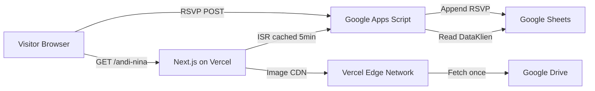

# Digital Wedding Invitation Platform — Walkthrough

## Summary

Built a complete "Done-For-You" digital wedding invitation platform using **Next.js 16 (App Router)**, **TypeScript**, and **Tailwind CSS**, with **Google Sheets** as the database via **Google Apps Script**.

---

## Architecture



## File Tree

```
d:/web-tubagus/digital_undangan/
├── app/
│   ├── [slug]/
│   │   ├── page.tsx          ← Dynamic invitation (ISR, SEO metadata)
│   │   └── not-found.tsx     ← Elegant 404 for invalid slugs
│   ├── layout.tsx            ← Root layout (Indonesian locale)
│   ├── page.tsx              ← Landing/home page
│   └── globals.css           ← Custom animations + Tailwind base
├── components/
│   ├── themes/
│   │   ├── ThemeRenderer.tsx  ← Maps theme_id → component
│   │   ├── ThemeElegant.tsx   ← Rose & gold serif theme
│   │   └── ThemeRustic.tsx    ← Earthy sage & amber theme
│   └── ui/
│       ├── DriveImage.tsx     ← Google Drive → next/image wrapper
│       ├── RsvpForm.tsx       ← RSVP form + optimistic UI + guestbook
│       └── Toast.tsx          ← Slide-in toast notification
├── gas/
│   └── Code.gs               ← Google Apps Script (paste into GAS editor)
├── lib/
│   ├── api.ts                ← getClientData (ISR), submitRsvp
│   └── utils.ts              ← cn(), formatDate(), extractDriveFileId()
├── types/
│   └── index.ts              ← ClientData, RsvpEntry, RsvpPayload, GASResponse
├── .env.local                 ← GAS Web App URL (gitignored)
├── .env.example               ← Template for env vars
├── next.config.ts             ← Google Drive image domains
└── package.json
```

---

## Phase-by-Phase Summary

### Phase 1 — Project Setup & TypeScript Interfaces

| What | Details |
|------|---------|
| Command | `npx create-next-app@latest ./ --ts --tailwind --eslint --app --use-npm` |
| Extra deps | `clsx`, `tailwind-merge` |
| Interfaces | `ClientData`, `RsvpEntry`, `RsvpPayload`, `GASResponse<T>` |
| Utilities | `cn()`, `formatDate()`, `extractDriveFileId()`, `getDriveImageUrl()` |

### Phase 2 — Google Apps Script Backend

[Code.gs](file:///d:/web-tubagus/digital_undangan/gas/Code.gs) contains:
- **`doGet(e)`** — looks up slug in "DataKlien" sheet, returns JSON with all fields
- **`doPost(e)`** — appends RSVP to "RSVP" sheet with auto-timestamp
- **CORS strategy** — `text/plain` content-type on client to bypass preflight

### Phase 3 — ISR Data Fetching & Dynamic Pages

- [api.ts](file:///d:/web-tubagus/digital_undangan/lib/api.ts) — `fetch()` with `next: { revalidate: 300 }` for 5-minute ISR cache
- [page.tsx](file:///d:/web-tubagus/digital_undangan/app/%5Bslug%5D/page.tsx) — async server component, `generateMetadata()` for SEO, `notFound()` fallback
- [ThemeRenderer.tsx](file:///d:/web-tubagus/digital_undangan/components/themes/ThemeRenderer.tsx) — `THEME_MAP` registry for extensible theme switching

### Phase 4 — Google Drive Image Optimization

- [next.config.ts](file:///d:/web-tubagus/digital_undangan/next.config.ts) — `remotePatterns` for 3 Google domains
- [DriveImage.tsx](file:///d:/web-tubagus/digital_undangan/components/ui/DriveImage.tsx) — extracts file ID from any Drive URL format, serves via Vercel Edge CDN

### Phase 5 — RSVP Form with Optimistic UI

- [RsvpForm.tsx](file:///d:/web-tubagus/digital_undangan/components/ui/RsvpForm.tsx) — optimistic guestbook update, background POST, theme-adaptive styling
- [Toast.tsx](file:///d:/web-tubagus/digital_undangan/components/ui/Toast.tsx) — slide-in/fade notification with auto-dismiss

---

## Build Verification

```
✓ Compiled successfully in 13.8s
✓ TypeScript passed in 11.7s
✓ Static pages generated (4/4) in 2.1s
✓ Zero errors
```

---

## Next Steps

> [!IMPORTANT]
> **To make it live, you need to:**

1. **Set up Google Sheets** with two tabs: "DataKlien" and "RSVP" with the correct column headers
2. **Paste `gas/Code.gs`** into Google Apps Script editor (Extensions → Apps Script)
3. **Deploy as Web App** (Execute as: Me, Access: Anyone) and copy the `/exec` URL
4. **Update `.env.local`** with your GAS deployment URL
5. **Add test data** in the "DataKlien" tab (e.g., slug: `andi-nina`, theme_id: `elegant`)
6. **Run `npm run dev`** and visit `localhost:3000/andi-nina` to test

> [!TIP]
> To add a new theme, create a component in `components/themes/`, then add it to `THEME_MAP` in `ThemeRenderer.tsx`. Use a matching `theme_id` value in your Google Sheet.
